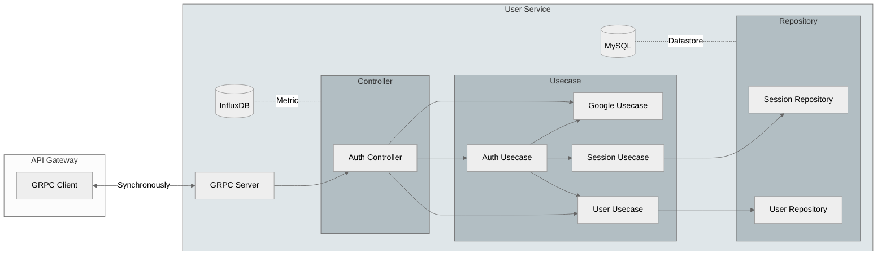

# Codern

A service to manage Codern's user data and authentication stuff, this repository creates a [gRPC](https://grpc.io/) for synchronous communication and data exchange with our API Gateway to aggregate response data. It is primarily written in [Go](https://go.dev/) to ensure simplicity and speed.

## Contribution

### Prerequisite

We highly recommended [Visual Studio Code](https://code.visualstudio.com/) for development with a [Dev Containers](https://marketplace.visualstudio.com/items?itemName=ms-vscode-remote.remote-containers) extension.

> Don't forget to install **[Docker](https://www.docker.com/)**, if you don't have one!

### Architecture

Codern has adopted a [Microservice](https://microservices.io/) architecture and embraces the [Clean Architecture](https://blog.cleancoder.com/uncle-bob/2012/08/13/the-clean-architecture.html) principle for the development of this repository.

The User service, which is the focus of this repository, creates a gRPC server and listens on port 3001. It utilizes [Protobuf](https://protobuf.dev/), defined in the [proto repository](https://github.com/codern-org/proto) as a submodule, which is stored in the `/internal/proto/` directory. By leveraging this setup, our system effectively monitors and measures various metrics such as uptime and response time. We use [InfluxDB](https://github.com/influxdata/influxdb) for visualization and alerting to provide developers with valuable insights and facilitate easy investigation of system incidents.

To organize and manage our data, we utilize a relational database, specifically [MySQL](https://www.mysql.com/). This allows us to store information in predefined relationships, ensuring efficient data management.

Our development pipeline includes automatic database migration whenever changes are pushed to the main branch. This ensures that our database remains up to date and seamlessly accommodates any modifications made to the system.

The diagram below demonstrates the overview of the User Service and API Gateway structure:

### License

Copyright (c) Vectier. All rights reserved.
