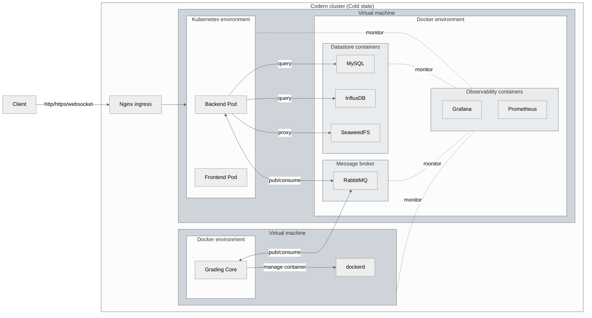

    
    <h2>Codern</h2>
    
<b>An open-source Coding Platform</b>

**Codern** is an open-source coding platform that focuses on providing a seamless setup for coding event organizers and participants, enabling them to enhance their programming skills through interactive coding experiences.

> [!NOTE]
> This repository contains the API server of Codern only. If you are interested in exploring how the Codern user interface was created, please visit the link [here](https://github.com/codern-org/ui).

We utilize [third-party software](https://github.com/Porama6400/GradingCore2), developed by Porama6400, for grading the source code submitted by users on our platform.

## 📚 Proposal

### Architecture

#### We don't need Microservice

Behind the scenes, the Codern API server was built using lighting-fast web framework, [Fiber](https://docs.gofiber.io/). Our codebase was designed with a monolithic architecture. Previosuly, we adopted a Microservice architecture for building everything (see [legacy version](https://github.com/codern-org/legacy)), but we eventually made the decision to switch back to a monolith. We found that the Microservice architecture didn't provide us any significant advantages, only introducing development difficulties. As the result, **we opted for the more streamlined monolithic approach.**

#### Clean architecture

This project follows the Clean Architecture principles, ensuring a modular and maintainable codebase. With clear separation of core business logic from external dependencies, it promotes flixibility and scalability. This approach also facilitates easier testing.

_Thanks to Uncle Bob, for the [article](https://blog.cleancoder.com/uncle-bob/2012/08/13/the-clean-architecture.html) of Clean Architecture._

#### Logging & Measurement

This project utilizes [InfluxDB](https://www.influxdata.com/), [Prometheus](https://prometheus.io/), [Grafana](https://grafana.com/) and to achieve a robust log and metric management system. With InfluxDB for time-series storage, Prometheus for monitoring, and Grafana for visualization, we ensure optimal performance and proactive issue detection.

### Early access stage

We are currently in the beta version of the development phase, and we had the opportunity to run and exeperiment with our system design during the Bangmod Hacakthon 2024. This event, organized by [King Mongkut University of Technology Thonburi](https://www.kmutt.ac.th/), saw participation from approximately 200 schools across Thailand in this coding competition.

During the 3-hour event, we encountered a high traffic load on our system, with around **`400,000 requests (40 req/s)`**. It's important to note that we were using only one instance of the main server (4 CPU cores / 8 GB RAM) and two instances of worker servers (1 CPU core / 1 GB RAM). Users had a positive experience, receiving code results quickly from our system, with an average grading latency of about 7 seconds.

>We are proud to share that our system demonstrated an impressive success rate of **`99.99%`** on API requests during the Bangmod Hackathon 2024, showcasing the robustness and reliability of our platform even under high traffic conditions.

## Contribution

There are many ways in which you can participate in this project, for example:

- [Submit bugs and feature requests](https://github.com/codern-org/codern/issues).
- Fixing issues and contributing directly to the code base by [submitting pull requests](https://github.com/codern-org/codern/pulls).

## Supporters

&nbsp;&nbsp;

## License

Copyright (c) Vectier. All rights reserved.
