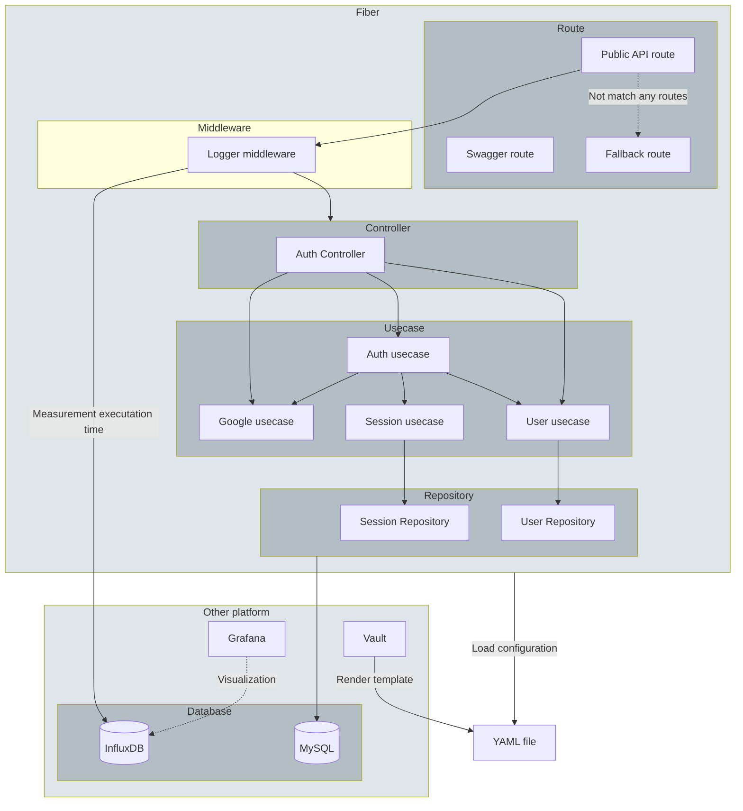

    
    <h2>Codern</h2>
    
<b>An open-source Coding Platform</b>

**Codern** is an open-source coding platform that focuses on providing a seamless setup for coding event organizers and end-users, enabling them to enhance their programming skills through interactive coding experiences.

> [!NOTE]
> This repository contains the API Server of Codern only. If you are interested in exploring how the Codern user interface was created, please visit the link [here](https://github.com/codern-org/ui).

> This project also serves as an experimental playground for the founders of Codern, allowing them to learn and develop a robust system as part of their Computer Engineering senior project.

## Proposal

### Architecture

Click to expand!

#### We don't need Microservice

Behind the scenes, the Codern API server was built using lighting-fast web framework, [Fiber](https://docs.gofiber.io/). Our codebase was designed with a monolithic architecture. Previosuly, we adopted a Microservice architecture for building everything (see [legacy version](https://github.com/codern-org/legacy)), but we eventually made the decision to switch back to a monolith. We found that the Microservice architecture didn't provide us any significant advantages, only introducing development difficulties. As the result, **we opted for the more streamlined monolithic approach.**

#### Clean architecture

This project follows the Clean Architecture principles, ensuring a modular and maintainable codebase. With clear separation of core business logic from external dependencies, it promotes flixibility and scalability. This approach also facilitates easier testing.

_Thanks to Uncle Bob, for the [article](https://blog.cleancoder.com/uncle-bob/2012/08/13/the-clean-architecture.html) of Clean Architecture._

#### Logging & Measurement

This project utilizes [InfluxDB](https://www.influxdata.com/), [Prometheus](https://prometheus.io/), [Grafana](https://grafana.com/) and to achieve a robust log and metric management system. With InfluxDB for time-series storage, Prometheus for monitoring, and Grafana for visualization, we ensure optimal performance and proactive issue detection.

## Contribution

### Prerequisite

We highly recommended [Visual Studio Code](https://code.visualstudio.com/) for development with a [Dev Containers](https://marketplace.visualstudio.com/items?itemName=ms-vscode-remote.remote-containers) extension.

## License

Copyright (c) Vectier. All rights reserved.
